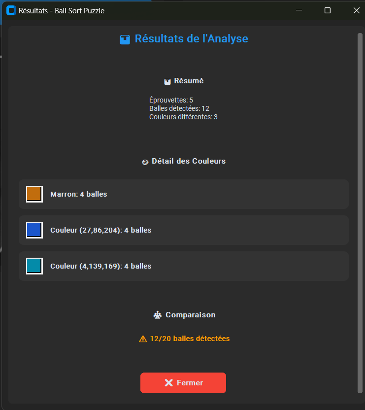

# Ball Sort Puzzle Solver

Une application moderne avec interface graphique pour résoudre automatiquement les puzzles de type "Ball Sort" en utilisant la vision par ordinateur.


## 🎯 Description

Ball Sort Puzzle Solver est un outil intelligent qui utilise des techniques de traitement d'image avancées pour analyser et résoudre automatiquement les puzzles de tri de balles. L'application peut détecter les couleurs des balles, identifier leur position dans les éprouvettes, et fournir des analyses détaillées.

## ✨ Fonctionnalités

- **Interface moderne** : Interface utilisateur élégante avec CustomTkinter
- **Analyse d'images** : Détection automatique des balles et de leurs couleurs
- **Mode multi-rangées** : Support pour l'analyse de plusieurs rangées d'éprouvettes
- **Outils de recadrage** : Sélection précise de la zone d'intérêt
- **Sélection de coins** : Définition manuelle des points de référence
- **Génération de grille** : Création automatique de grilles de détection
- **Analyse colorimétrique** : Groupement intelligent des balles par couleur
- **Résultats détaillés** : Fenêtres de résultats avec statistiques complètes



## 🛠️ Technologies utilisées

- **Python 3.7+**
- **CustomTkinter 5.2.0+** : Interface graphique moderne
- **OpenCV** : Traitement d'images
- **Pillow (PIL)** : Manipulation d'images
- **NumPy** : Calculs numériques
- **scikit-learn** : Analyse et clustering des couleurs

## 📦 Installation

### Prérequis

- Python 3.7 ou plus récent
- pip (gestionnaire de paquets Python)

### Installation des dépendances

```bash
# Cloner le repository
git clone https://github.com/goddivor/ball-sort-puzzle-solver.git
cd ball-sort-puzzle-solver

# Installer les dépendances
pip install -r requirements.txt
```

## 🚀 Utilisation

### Lancement de l'application

```bash
python main.py
```

### Guide d'utilisation

1. **Charger une image** : Cliquez sur "📁 Charger Image" et sélectionnez une capture d'écran de votre puzzle
2. **Recadrer l'image** : Utilisez l'outil de recadrage pour isoler la zone des éprouvettes
3. **Sélectionner les coins** : Définissez les 4 coins de la grille d'éprouvettes
4. **Configurer les paramètres** :
   - Nombre d'éprouvettes
   - Nombre de balles par éprouvette
   - Espacement de la grille
   - Tolérance des couleurs
5. **Générer la grille** : Créez automatiquement la grille de détection
6. **Analyser les couleurs** : Lancez l'analyse pour détecter et grouper les balles par couleur

### Mode multi-rangées

Pour les puzzles complexes avec plusieurs rangées :

1. Configurez le nombre de rangées dans les paramètres
2. Utilisez les boutons de navigation "◀ Précédent" et "Suivant ▶"
3. Configurez chaque rangée individuellement
4. Terminez avec "🏁 Terminer" pour voir les résultats globaux

## 🏗️ Architecture du projet

```
ball-sort-puzzle-solver/
├── main.py                 # Application principale
├── requirements.txt        # Dépendances Python
├── models/                 # Modules de traitement
│   ├── __init__.py
│   ├── color_analyzer.py   # Analyse des couleurs
│   ├── grid_generator.py   # Génération de grilles
│   ├── image_processor.py  # Traitement d'images
│   └── multi_row_manager.py # Gestion multi-rangées
├── ui/                     # Interface utilisateur
│   ├── __init__.py
│   ├── corner_selector.py  # Sélection des coins
│   ├── crop_tool.py        # Outil de recadrage
│   └── parameter_panel.py  # Panneau de paramètres
└── screens/                # Captures d'écran
    ├── gui-ctk-main.png
    └── gui-ctk-result.png
```

## 🎨 Personnalisation

L'application utilise le thème sombre de CustomTkinter par défaut. Vous pouvez modifier l'apparence dans `main.py` :

```python
# Modes: "System", "Dark", "Light"
ctk.set_appearance_mode("dark")

# Thèmes: "blue", "green", "dark-blue"
ctk.set_default_color_theme("blue")
```

## 🔧 Développement

### Structure des classes principales

- **BallSortSolver** : Classe principale de l'application
- **ImageProcessor** : Traitement et manipulation d'images
- **GridGenerator** : Génération de grilles de détection
- **ColorAnalyzer** : Analyse et clustering des couleurs
- **MultiRowManager** : Gestion des configurations multi-rangées
- **ParameterPanel** : Interface des paramètres utilisateur

### Ajout de nouvelles fonctionnalités

1. Créez un nouveau module dans le dossier approprié (`models/` ou `ui/`)
2. Importez et intégrez le module dans `main.py`
3. Ajoutez les callbacks nécessaires dans `ParameterPanel`

## 🐛 Résolution de problèmes

### Problèmes courants

- **Image non chargée** : Vérifiez que le format d'image est supporté (PNG, JPG, JPEG, BMP)
- **Détection incorrecte** : Ajustez la tolérance des couleurs et l'espacement de la grille
- **Coins mal placés** : Redéfinissez les 4 coins en cliquant précisément sur les angles des éprouvettes

### Débogage

Activez le mode debug en modifiant les paramètres de log dans les modules concernés.

## 📄 Licence

Ce projet est sous licence MIT. Voir le fichier `LICENSE` pour plus de détails.

## 🤝 Contribution

Les contributions sont les bienvenues ! N'hésitez pas à :

1. Fork le projet
2. Créer une branche pour votre fonctionnalité
3. Commiter vos changements
4. Pousser vers la branche
5. Ouvrir une Pull Request

## 📞 Support

Pour toute question ou problème, ouvrez une issue sur GitHub ou contactez les mainteneurs du projet.

---

**Développé avec ❤️ pour la communauté des amateurs de puzzles logiques**